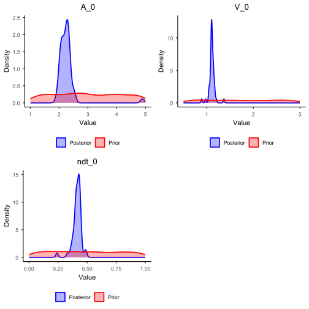
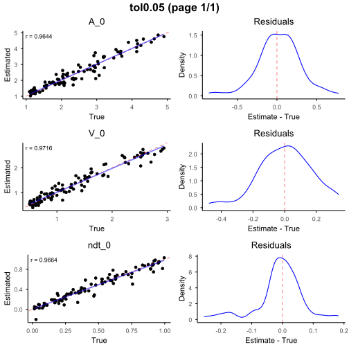
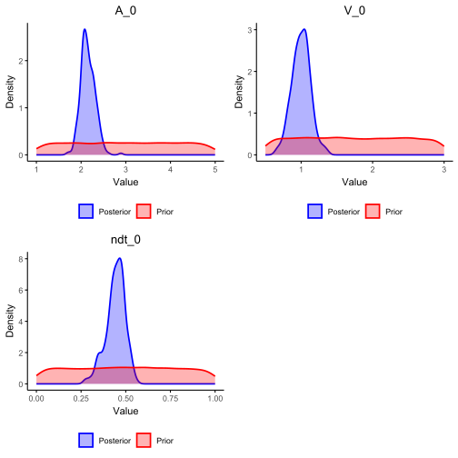
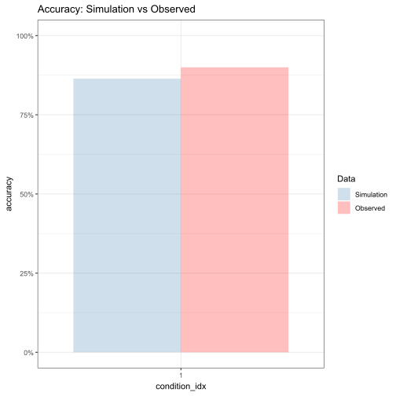
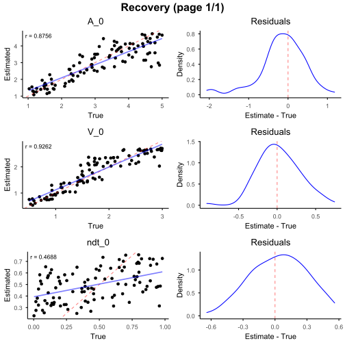
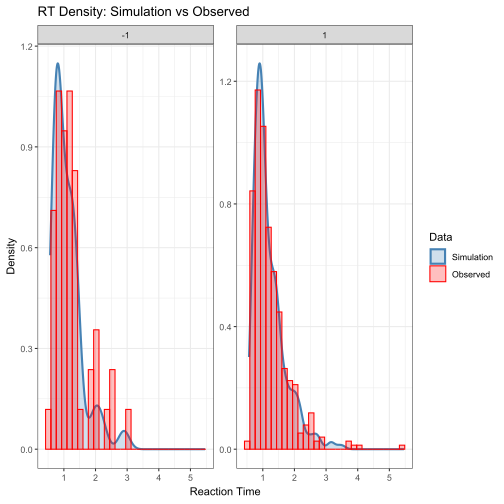
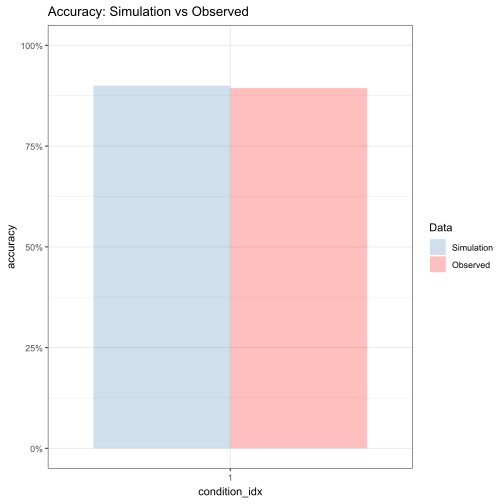
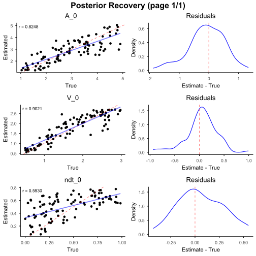
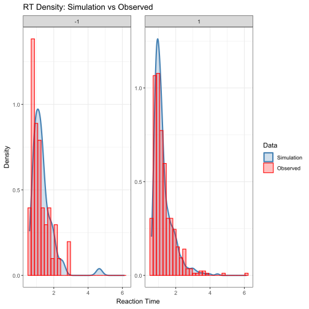
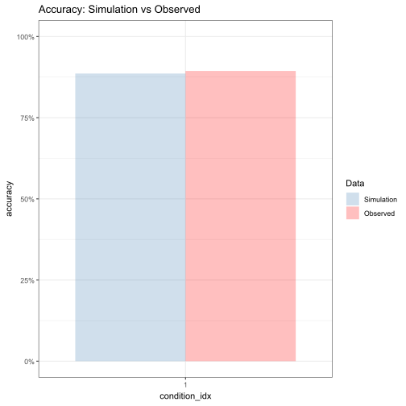

This section aims to help you grasp the basic workflow to run this package. In this section, we will outline the main functionality of the package and demonstrating a minimal working example that can be run with minimal knowledge about EAMs.

The workflow implemented in **eam** follows the standard workflow in simulation-based inference. First, we begin by specifying a data-generating process, simulate data under a range of parameter values, and then use simulation-based inference to learn which parameters are most consistent with the observed data.

Concretely, the workflow consists of four steps:

1. **Model specification and simulation**: Define an evidence accumulation model by specifying its structural components (boundaries, drift, noise, and non-decision processes), and simulate synthetic datasets from the prior.
1. **Summary statistics computation**: Reduce both simulated and observed data to informative summary statistics that capture key data patterns.
1. **Parameter estimation and recovery**: Use ABC (or ABI) to infer posterior distributions over parameters, and evaluate whether the inference procedure can reliably recover known parameters.
1. **Model evaluation and comparison**: Assess model adequacy using posterior predictive checks, and compare alternative model specifications.

The following sections walk through these steps in detail using a simple DDM example, before extending the workflow to more complex models.

---

In this example, we start with a simple three-parameter two-boundary Diffusion Decision Model (DDM).

Although the DDM has a trackable likelihood, we deliberately treat it as a generative model here. This allows us to demonstrate the full simulation-based workflow in a setting where the ground truth is known.

Here, we adopt a slightly different parameterization from the conventional DDM: instead of assuming accumulation from a positive starting point toward 0 or $a$, evidence is initialized at zero and evolves toward symmetric bounds at $a$ and $-a$.

### Description of the model

The details of this model is listed below:

**Priors on global parameters**

$$
\begin{aligned}
A_0 &\sim \text{Uniform}(1, 5), \\
V_0 &\sim \text{Uniform}(0.5, 3), \\
ndt_0 &\sim \text{Uniform}(0, 1), \\
\rho_0 &= 0.5 .
\end{aligned}
$$

**Item-level parameterization**

$$
\begin{aligned}
\rho &= \rho_0, \\
A_{\text{upper}} &= \rho A_0, \\
A_{\text{lower}} &= -\rho A_0, \\
V &= V_0, \\
ndt &= ndt_0 .
\end{aligned}
$$

**Evidence accumulation dynamics**

$$
dX(t) = V \, dt + dW(t), \qquad dW(t) \sim \mathcal{N}(0, dt).
$$

A decision is made when $X(t)$ first reaches either $A_{\text{upper}}$ or $A_{\text{lower}}$, and the observed response time is

$$
RT = T_{\text{decision}} + ndt .
$$

### Step one: Model setup

First, we load the required packages.


``` r
# Load necessary packages
library(eam)
library(dplyr)
library(rtdists)
library(tidyr)

# Set a random seed for reproducibility
set.seed(1)
```

Then, we specify the model configuration according to the setup described above.


``` r
#######################
# Model specification #
#######################
# Define the number of accumulators
n_items <- 1

# Set the number of accumulators in the model
prior_params <- tibble(
  n_items = n_items
)

# Specify the prior distributions for free parameters
prior_formulas <- list(
  # Decision boundary
  A_0 ~ distributional::dist_uniform(1, 5),
  # Drift rate
  V_0 ~ distributional::dist_uniform(0.5, 3),
  # Non-decision time
  ndt_0 ~ distributional::dist_uniform(0, 1),
  # Relative starting point
  rho_0 ~ 0.5
)

# Specify the between-trial components (skipped here)
between_trial_formulas <- list()

# Specify the item-level parameters
item_formulas <- list(
  # Relative starting point
  rho ~ rho_0,
  # Decision boundary
  A_upper ~ rho * (A_0), # upper
  A_lower ~ -rho * (A_0), # lower
  # Drift rate
  V ~ V_0,
  # Non-decision time
  ndt ~ ndt_0
)

# Specify the diffusion noise
noise_factory <- function(context) {
  function(n, dt) {
    rnorm(n, mean = 0, sd = sqrt(dt))
  }
}
```


### Step two: Data simulation

Once the model is specified, we can proceed to data simulation. The simulation step generates a large collection of synthetic datasets by sampling parameters from their prior distributions and simulating data from the corresponding generative model. Each simulated dataset represents a possible outcome implied by the assumed model.


``` r
####################
# Simulation setup #
####################
sim_config <- new_simulation_config(
  # Pass the model information
  prior_formulas = prior_formulas,
  between_trial_formulas = between_trial_formulas,
  item_formulas = item_formulas,
  # Specify the simulation conditions and number of trials
  n_conditions = 1000,
  n_trials_per_condition = 100,
  # Specify the number of accumulators and the number of recorded accumulators
  n_items = n_items,
  max_reached = n_items,
  # Specify the total elapsed time and time step
  max_t = 10,
  dt = 0.001,
  # Specify the noise structure
  noise_mechanism = "add",
  noise_factory = noise_factory,
  # Specify the model type
  model = "ddm-2b",
  # Specify the parallel computing settings
  parallel = FALSE, # In tutorial, we disable parallelization, but you are encouraged to enable it locally
  n_cores = NULL, # When parallel enabled, will use default: detectCores() - 1
  rand_seed = NULL # Will use default random seed
)

##################
# Run simulation #
##################
sim_output <- run_simulation(
  config = sim_config
)
```


### Step three: Load observed data

For observed data, we create a small dataset using the **rtdists** package, which provides fast simulators for standard DDM. Specifically, we simulate `N = 500` trials from a two-boundary DDM with fixed parameters ($a$, $v$, $t0$) where $a$ controls boundary separation, $v$ is the drift rate, and $t0$ captures non-decision time.

The function `rdiffusion()` returns response labels (`"upper"`/`"lower"`) and response times. For consistency with the data format produced by our simulation engine, we recode responses into a numeric choice variable (1 for the upper boundary and -1 for the lower boundary), and we add a `condition_idx` field to indicate that all trials belong to a single experimental condition.


``` r
############################
# Observed data generation #
############################

N <- 500

pars <- list(
  a  = 2.0,   # Decision boundary
  v  = 1.0,   # Drift rate
  t0 = 0.5  # Non-decision time
)

# rdiffusion() will return responses and RTs from a standard DDM
observed_data <- rdiffusion(n = N, a = pars$a, v = pars$v, t0 = pars$t0)

# Recode the data to be consistent with simulated data
observed_data$choice <- ifelse(observed_data$response == "upper", 1, -1)
observed_data$condition_idx <- 1
```

## Approximate Bayesian Computation Pipleline

### Step four: Extract summary statistics

We define a summary pipeline that extracts two types of common summary statistics of the DDM data: (i) the accuracy and (ii) RT quantiles (10%, 30%, 50%, 70%, 90%) computed separately for each choice category (1 vs. -1).

We then apply the same summary procedure to every simulated dataset to obtain `simulation_sumstat`, and to the observed dataset to obtain `target_sumstat`. Finally, `build_abc_input()` aligns the simulated and observed summaries into a consistent structure.


``` r
#####################
# abc model prepare #
#####################

# Define the summary procedure
summary_pipe <-
  summarise_by(
    .by = c("condition_idx"),
    acc = sum(choice == 1) / sum(!is.na(choice)),
  ) +
  summarise_by(
    .by = c("condition_idx", "choice"),
    rt_quantiles = quantile(rt, probs = c(0.1, 0.3, 0.5, 0.7, 0.9))
  )

# Calculate simulated summary statistics
simulation_sumstat <- map_by_condition(
  sim_output,
  .progress = TRUE,
  .parallel = FALSE, # turn on if you want to speed up
  function(cond_df) summary_pipe(cond_df)
)

# Calculate observed summary statistics
target_sumstat <- summary_pipe(observed_data)

# Align the simulated and observed summary statistics
abc_input <- build_abc_input(
  simulation_output = sim_output,
  simulation_summary = simulation_sumstat,
  target_summary     = target_sumstat,
  param = c("A_0", "V_0", "ndt_0")
)
```

---

### Step five: Fit the model

With the simulated and observed summary statistics aligned, we can now estimate the posterior distribution of the model parameters using Approximate Bayesian Computation (ABC).

Specifically, we fit an ABC model by comparing the simulated summary statistics to the observed summary statistics. Then we retain (or reweight) parameter draws that best reproduce the observed summaries under a tolerance level (`tol = 0.05`).

Here we use a regression-based-adjusted ABC variant (`method = "loclinear"`), which learns a flexible mapping from summary statistics to parameters to improve posterior approximation.

These diagnostics help verify whether the posterior concentrates on plausible regions of the parameter space and whether the recovered parameters are consistent with the parameters in the `rdiffusion()` model.


``` r
########################
# Parameter estimation #
########################

# Fit abc model (neuralnet)
abc_fit <- abc::abc(
  target = abc_input$target,
  param  = abc_input$param,
  sumstat= abc_input$sumstat,
  tol    = 0.05,
  method = "loclinear"
)
#> Warning: All parameters are "none" transformed.
```

---

After fitting, we summarize the posterior means/medians and 95% credible intervals and visualize the resulting posterior distributions.

As shown, the true parameter values underlying the observed data lie well within the 95% credible intervals of the posterior distributions.


``` r
# Posterior estimation check
summarise_posterior_parameters(
  abc_fit,
  ci_level = 0.95
)
#>   parameter      mean    median ci_lower_0.025 ci_upper_0.975
#> 1       A_0 2.2699966 2.2522988      1.9978171      2.5227772
#> 2       V_0 1.1104511 1.1080758      0.9895468      1.1966138
#> 3     ndt_0 0.4130898 0.4182996      0.3370902      0.4748187

plot_posterior_parameters(
  abc_fit,
  abc_input
)
```



---

### Step six: Model evaluation

The next step is to evaluate parameter recovery for the model. To do so, we run `cv4abc()` as a cross-validation procedure.

First, we specify the number of validation datasets (`N = 100`). The function then randomly samples `N` conditions from the simulated summary statistics, treats their associated parameter values as known ground truth, and re-estimates the parameters using the fitted ABC object under the same tolerance level.

Recovery performance is visualized using `plot_cv_recovery()`, which compares the estimated parameters with their true values across validation datasets.

Good recovery is indicated by a high correlation between estimated and true parameters (good: $r \ge 0.75$; excellent: $r \ge 0.90$) and by estimates clustering closely around the identity line with minimal residual dispersion.

The `resid_tol` option trims extreme residuals (here retaining the central 99%), making the main recovery pattern easier to inspect.

As shown, the three parameters exhibit excellent recovery.


``` r
# Parameter recovery check
abc_cv <- abc_cv(
  abc_input = abc_input,
  abc_result = abc_fit,
  nval = 100,
  tols = c(0.05)
)

plot_cv_recovery(
  abc_cv,
  n_rows = 3,
  n_cols = 1,
  resid_tol = 0.99,
  interactive = FALSE
)
```



---

As a final diagnostic, we perform a posterior predictive check to assess the adequacy of the fitted model.

Specifically, we generate the posterior data using posterior median estimates obtained from the ABC analysis. The resulting posterior predictive simulations are then compared with the observed dataset.

By visually inspecting the overlap between simulated and observed RT distributions and accuracy rates, we can evaluate whether the fitted model is able to reproduce key empirical patterns.


``` r
##############################
# Posterior predictive check #
##############################

abc_posterior_predictive_check(
  config = sim_config, # Simulation configuration
  abc_result = abc_fit, # ABC fitting result
  observed_df = observed_data,  # Observed dataset for comparison
  n_conditions = 1, # Number of experimental conditions
  n_trials_per_condition = 500, # Number of trials simulated per condition
  rt_facet_x = c("choice"), # RT plot facet (x)
  rt_facet_y = c(),   # RT plot facet (y)
  accuracy_x = "rank_idx",  # Accuracy plot x-axis variable
  accuracy_facet_x = c(), # Accuracy plot facet (x)
  accuracy_facet_y = c()  # Accuracy plot facet (y)
)
```



---

### Step seven (optional): Model comparison

Beyond parameter estimation, the **eam** package also supports model comparison within a simulation-based inference framework.

In this example, we construct an alternative model by deliberately modifying the prior specification of the relative starting point parameter $\rho$, while keeping all other components of the model unchanged. This allows us to isolate the contribution of this parameter assumption to overall model fit. Synthetic data are then generated under the alternative model, and the same summary statistics pipeline is applied to ensure comparability across models.

Model comparison is conducted using the `abc_postpr()` function, which estimates posterior model probabilities based on Approximate Bayesian Computation. Intuitively, this procedure assesses which model is more likely to have generated the observed data by comparing the proximity of simulated summary statistics from each model to the target summary statistics, given a fixed tolerance level.

The resulting posterior probabilities indicate the relative likelihood that the observed data were generated by each candidate model. These probabilities can be summarized using Bayes factors, which quantify the strength of evidence in favor of one model over another. Conventionally, Bayes factors greater than 3 or smaller than 1/3 are interpreted as providing substantial evidence for one model relative to its competitor.


``` r
# Deliberately change the rho in the alternative model
prior_formulas_alt <- list(
  # Decision boundary
  A_0 ~ distributional::dist_uniform(1, 5),
  # Drift rate
  V_0 ~ distributional::dist_uniform(0.5, 3),
  # Non-decision time
  ndt_0 ~ distributional::dist_uniform(0, 1),
  # Relative starting point
  rho_0 ~ 0.7
)

sim_config_alt <- sim_config
sim_config_alt$prior_formulas <- prior_formulas_alt

# Run the simulation
sim_output_alt <- run_simulation(
  config = sim_config_alt
)

# Calculate simulated summary statistics for the alternative model
simulation_sumstat_alt <- map_by_condition(
  sim_output_alt,
  .progress = TRUE,
  .parallel = FALSE,
  function(cond_df) summary_pipe(cond_df)
)

abc_input_alt <- build_abc_input(
  simulation_output = sim_output_alt,
  simulation_summary = simulation_sumstat_alt,
  target_summary = target_sumstat,
  param = c("A_0", "V_0", "ndt_0")
)

# Run the model comparison
postpr_result <- abc_postpr(
  sumstats = list(
    abc_input$sumstat,
    abc_input_alt$sumstat
  ),
  target = abc_input$target,
  tol = 0.05,
  method = "rejection"
)

summary(postpr_result)
#> Call: 
#> abc::postpr(target = target, index = index, sumstat = sumstat, 
#>     tol = 0.05, method = "rejection")
#> Data:
#>  postpr.out$values (100 posterior samples)
#> Models a priori:
#>  model_1, model_2
#> Models a posteriori:
#>  model_1, model_2
#> 
#> Proportion of accepted simulations (rejection):
#> model_1 model_2 
#>     0.9     0.1 
#> 
#> Bayes factors:
#>         model_1 model_2
#> model_1  1.0000  9.0000
#> model_2  0.1111  1.0000
```

---

## Amortized Bayesian Inference Pipleline (Point Estimation)

### Step four: Prepare input features

We construct the input matrix $Z$ from the observed data, containing trial-level choice and reaction time (RT).

The same structure is used for both simulated and observed datasets.

The function `build_abi_input()` then aligns simulated data and parameters into a consistent format for training.


``` r
#####################
# abc model prepare #
#####################
library(dplyr)
library(tidyr)

Z_observed <- observed_data %>%
  mutate(trial = row_number()) %>%
  select(trial, choice, rt) %>%
  pivot_longer(
    cols = c(choice, rt),
    names_to = "variable",
    values_to = "value"
  ) %>%
  pivot_wider(
    names_from = trial,
    values_from = value
  )

Z_observed <- as.matrix(Z_observed[, -1])
Z_observed

# Align the simulated and observed summary statistics
abi_input <- build_abi_input(
  sim_output,
  theta = c(
    "A_0", "V_0", "ndt_0"
  ),
  Z = c(
    "choice",
    "rt"
  ),
  train_ratio = 0.8,
  n_test = 100
)
```

---

### Step five: Fit the model

We train a neural estimator to learn the mapping from observed data $Z$ to model parameters $\theta$.

Here we use a point estimator, which directly predicts parameter values from the input data.

The input dimension `d = 2` corresponds to the two observed variables per trial (choice and RT).
The DeepSet encoder maps a set of trials into a fixed-length representation, which is then transformed into parameter estimates.

The output dimension equals the number of parameters (`p = 3`), with each parameter predicted by a dedicated output unit using a softplus activation to enforce valid (positive) values.


``` r
########################
# Parameter estimation #
########################

# Fit abi model
point_estimator <- "
  d = 2    # dimension of data
  w = 32   # number of neurons in each hidden layer

  # Layer to ensure valid estimates
  final_layer = Parallel(
      vcat,
      Dense(w, 1, softplus), #first parameter
      Dense(w, 1, softplus), #second parameter
      Dense(w, 1, softplus)  #third parameter 
    )

  psi = Chain(Dense(d, w, relu), Dense(w, w, relu), Dense(w, w, relu))
  phi = Chain(Dense(w, w, relu), Dense(w, w, relu), final_layer)
  deepset = DeepSet(psi, phi)
  estimator = PointEstimator(deepset)
"

trained_point_estimator <- abi_train(
  estimator = point_estimator,
  abi_input = abi_input,
  epochs = 100,
  stopping_epochs = 20
)
```

---

After training, we obtain point estimates of the parameters for the observed dataset.


``` r
# Point estimation check
point_est <- abi_estimate(
  trained_estimator = trained_point_estimator,
  Z = Z_observed
)

point_est
#>        estimate
#> A_0   1.8943079
#> V_0   1.0716629
#> ndt_0 0.4800706
```

---

### Step six: Model evaluation

We evaluate parameter recovery using simulated datasets.

The function `abi_assess()` performs a validation procedure by:

1. sampling datasets with known parameters
1. re-estimating parameters using the trained estimator
1. comparing estimated vs true parameters

Good recovery is indicated by high correlation between estimated and true values estimates concentrated around the identity line


``` r
# Parameter recovery check
assessment <- abi_assess(
  trained_estimator = trained_point_estimator,
  estimator_name = "NBE"
)
#> 	Running NBE...

plot_cv_recovery(assessment)
```



---

We assess model fit by generating simulated data using the estimated parameters and comparing them to the observed data.

This allows us to evaluate whether the model reproduces RT distributions and choice proportions


``` r
##############################
# Posterior predictive check #
##############################

abi_posterior_predictive_check(
  config = sim_config,
  trained_estimator = trained_point_estimator,
  estimator_type = "point",
  observed_df = observed_data,
  Z = Z_observed,
  rt_facet_x = c("choice"),
  rt_facet_y = c(),
  accuracy_x = "",
  accuracy_facet_x = c(),
  accuracy_facet_y = c()
)
```



---

## Amortized Bayesian Inference Pipleline (Posteiror Sample Estimation)

### Step four: Prepare input features

(Same as above)


``` r
#####################
# abc model prepare #
#####################

Z_observed <- observed_data %>%
  mutate(trial = row_number()) %>%
  select(trial, choice, rt) %>%
  pivot_longer(
    cols = c(choice, rt),
    names_to = "variable",
    values_to = "value"
  ) %>%
  pivot_wider(
    names_from = trial,
    values_from = value
  )

Z_observed <- as.matrix(Z_observed[, -1])
Z_observed
#>              1         2       3         4        5       6         7        8        9        10       11        12      13       14       15       16        17        18
#> [1,] -1.000000 -1.000000 1.00000 1.0000000 1.000000 1.00000 1.0000000 1.000000 1.000000 1.0000000 1.000000 1.0000000 1.00000 1.000000 1.000000 1.000000 1.0000000 -1.000000
#> [2,]  2.171105  2.874676 1.44698 0.8864481 2.104167 1.33265 0.6388183 1.321551 1.614517 0.7877165 1.164669 0.9488214 1.19743 2.197525 1.281529 1.478063 0.8485673  1.444674
#>            19      20        21        22        23        24       25       26        27        28        29        30       31       32       33        34       35       36
#> [1,] 1.000000 1.00000 1.0000000 -1.000000 1.0000000 1.0000000 1.000000 1.000000 1.0000000 1.0000000 1.0000000 1.0000000 1.000000 1.000000 1.000000 -1.000000 1.000000 1.000000
#> [2,] 1.177508 1.28913 0.8735773  1.376117 0.9266239 0.7257632 1.024721 1.133488 0.9487213 0.9283505 0.9354072 0.8800024 1.808904 1.053198 1.056073  1.129841 1.827052 1.497014
#>            37        38       39       40        41       42       43         44        45       46        47      48        49        50       51        52      53       54
#> [1,] 1.000000 1.0000000 1.000000 1.000000 1.0000000 1.000000 1.000000 -1.0000000 1.0000000 1.000000 1.0000000 1.00000 1.0000000 1.0000000 1.000000 1.0000000 1.00000 1.000000
#> [2,] 1.396684 0.8734456 1.280448 1.188907 0.7834405 1.435677 1.175416  0.6914361 0.9424297 1.421005 0.7228091 2.26064 0.9909233 0.7132939 1.560829 0.7846147 1.20881 1.027558
#>            55       56       57       58       59       60       61       62     63        64       65       66       67        68        69       70       71       72
#> [1,] 1.000000 1.000000 1.000000 1.000000 1.000000 1.000000 1.000000 1.000000 1.0000 1.0000000 1.000000 -1.00000 1.000000 -1.000000 1.0000000 1.000000 1.000000 1.000000
#> [2,] 1.144491 1.394592 1.090286 1.542756 2.785503 1.710847 0.689834 1.833253 1.0741 0.7449658 1.613473  1.04188 1.601041  1.772935 0.6690262 1.154254 1.698059 1.331169
#>            73      74        75        76       77       78       79      80       81        82        83       84       85         86       87        88       89       90
#> [1,] -1.00000 1.00000 1.0000000 1.0000000 1.000000 1.000000 1.000000 1.00000 1.000000 1.0000000 -1.000000 1.000000 1.000000 -1.0000000 1.000000 1.0000000 1.000000 1.000000
#> [2,]  1.78418 2.47989 0.6441206 0.6794174 2.486648 1.379806 1.919547 1.88357 1.362574 0.9551419  1.707419 1.061504 1.679752  0.9527299 1.929886 0.8376262 1.276849 1.849208
#>            91        92        93       94      95       96        97        98        99       100     101      102     103      104      105      106       107      108
#> [1,] 1.000000 1.0000000 -1.000000 1.000000 1.00000 1.000000 1.0000000 1.0000000 1.0000000 1.0000000 1.00000 1.000000 1.00000 1.000000 1.000000 1.000000 1.0000000 1.000000
#> [2,] 1.101254 0.6405702  1.011246 1.026176 1.54184 1.145256 0.6916204 0.9331501 0.7351867 0.9923604 2.53258 1.655325 2.00114 1.023542 2.099968 1.903528 0.9713177 2.103198
#>           109       110      111       112       113      114        115       116      117       118       119       120      121      122       123      124      125
#> [1,] 1.000000 1.0000000 1.000000 1.0000000 -1.000000 1.000000 -1.0000000 1.0000000 1.000000 1.0000000 1.0000000 1.0000000 1.000000 1.000000 1.0000000 1.000000 1.000000
#> [2,] 2.449127 0.7708309 3.065289 0.6519502  1.064743 1.377894  0.9729573 0.8147972 1.038793 0.8746318 0.8873199 0.7393402 1.229818 1.053337 0.6293164 1.667285 2.764431
#>           126      127     128       129       130       131      132      133      134      135       136      137      138      139       140      141       142        143
#> [1,] 1.000000 1.000000 1.00000 -1.000000 1.0000000 1.0000000 1.000000 1.000000 1.000000 1.000000 1.0000000 1.000000 1.000000 1.000000 1.0000000 1.000000 1.0000000 -1.0000000
#> [2,] 2.311841 1.578316 1.33598  1.778064 0.7161018 0.7538894 1.367332 2.740091 1.549038 1.689145 0.9247032 1.170792 1.058673 1.975783 0.7590616 1.032626 0.9819436  0.6598818
#>           144       145      146      147      148      149     150       151      152      153      154      155       156      157       158      159       160      161
#> [1,] 1.000000 -1.000000 1.000000 1.000000 1.000000 1.000000 1.00000 1.0000000 1.000000 1.000000 1.000000 1.000000 1.0000000 1.000000 -1.000000 1.000000 1.0000000 1.000000
#> [2,] 1.284501  1.032159 1.240627 1.167132 0.892737 1.264202 2.38195 0.8716598 0.640808 1.032892 2.845445 1.456882 0.8551658 2.294695  1.255088 2.408252 0.9186813 1.281062
#>           162      163      164       165       166      167      168      169      170      171       172      173      174       175       176       177      178      179
#> [1,] 1.000000 1.000000 1.000000 -1.000000 1.0000000 1.000000 1.000000 1.000000 1.000000 1.000000 1.0000000 1.000000 1.000000 1.0000000 1.0000000 1.0000000 1.000000 1.000000
#> [2,] 1.333723 1.324158 1.285586  1.385572 0.8907498 2.140454 1.101117 1.127781 2.016101 1.754016 0.5877378 1.562053 2.404201 0.7844429 0.8287129 0.6761349 1.081599 3.912172
#>            180       181       182      183       184      185       186      187       188       189      190       191      192       193      194      195      196
#> [1,] 1.0000000 -1.000000 1.0000000 1.000000 1.0000000 1.000000 1.0000000 1.000000 1.0000000 1.0000000 1.000000 1.0000000 1.000000 1.0000000 1.000000 1.000000 1.000000
#> [2,] 0.7510748  1.564603 0.6625367 2.455425 0.7986929 2.407532 0.6606578 0.807257 0.9885072 0.6464956 1.091372 0.8836803 2.196935 0.9983479 2.151196 1.012072 1.557134
#>            197      198       199       200      201      202       203      204       205     206      207        208      209       210       211      212      213       214
#> [1,] 1.0000000 1.000000 1.0000000 1.0000000 1.000000 1.000000 1.0000000 1.000000 1.0000000 1.00000 1.000000 -1.0000000 1.000000 1.0000000 1.0000000 1.000000 1.000000 -1.000000
#> [2,] 0.8634909 1.160625 0.9217073 0.7398062 1.272722 1.282197 0.7214134 1.092846 0.8815712 1.46154 0.969916  0.7506519 3.548463 0.9084313 0.6935972 1.740247 1.263457  2.879552
#>          215      216       217      218      219       220      221      222     223      224      225      226      227      228      229      230      231       232
#> [1,] 1.00000 1.000000 -1.000000 1.000000 -1.00000 -1.000000 1.000000 1.000000 1.00000 1.000000 1.000000 1.000000 1.000000 1.000000 1.000000 1.000000 1.000000 1.0000000
#> [2,] 1.01567 2.078707  1.187146 1.203234  1.13311  2.069356 1.393215 1.760605 1.47562 1.414235 1.485232 1.399999 1.160262 2.019206 1.049536 1.765198 1.109654 0.8463151
#>           233       234      235     236      237        238      239       240      241       242        243      244     245       246       247       248       249      250
#> [1,] 1.000000 1.0000000 1.000000 1.00000 1.000000 -1.0000000 1.000000 1.0000000 1.000000 1.0000000 -1.0000000 1.000000 1.00000 1.0000000 1.0000000 1.0000000 1.0000000 1.000000
#> [2,] 1.116656 0.9495003 2.014012 1.00382 1.808198  0.6230589 2.221166 0.7887451 0.820566 0.8040881  0.6259442 0.948881 1.11428 0.9692438 0.8186694 0.8688432 0.8744195 1.167972
#>           251      252      253      254       255        256       257      258    259        260      261      262      263       264      265       266       267      268
#> [1,] 1.000000 1.000000 1.000000 1.000000 1.0000000 -1.0000000 1.0000000 1.000000 1.0000 -1.0000000 1.000000 1.000000 1.000000 1.0000000 1.000000 1.0000000 1.0000000 1.000000
#> [2,] 1.382774 1.280165 1.211849 1.232794 0.9439029  0.8707468 0.7674448 1.342896 1.1276  0.9466259 2.177586 1.116866 1.066886 0.8168489 1.187518 0.9507882 0.7283724 1.168839
#>          269       270       271      272       273       274      275        276       277       278       279      280       281       282      283      284      285
#> [1,] 1.00000 1.0000000 1.0000000 1.000000 1.0000000 -1.000000 1.000000 -1.0000000 1.0000000 1.0000000 1.0000000 1.000000 1.0000000 1.0000000 -1.00000 1.000000 1.000000
#> [2,] 1.39417 0.8598649 0.7591527 2.745616 0.6791561  1.269233 1.206282  0.7699126 0.9290608 0.8258111 0.8501713 0.682595 0.7216251 0.8400356  2.13129 1.860337 1.182481
#>           286      287      288       289       290      291       292      293       294      295   296       297      298       299     300       301      302       303
#> [1,] 1.000000 1.000000 1.000000 1.0000000 1.0000000 1.000000 1.0000000 1.000000 1.0000000 1.000000 1.000 1.0000000 1.000000 1.0000000 1.00000 1.0000000 -1.00000 1.0000000
#> [2,] 2.444108 1.157153 2.415481 0.6086982 0.7959772 1.179815 0.9229961 1.412539 0.7180063 1.352101 1.324 0.9578317 1.194554 0.8953829 1.44325 0.9484618  1.51117 0.7367798
#>           304     305      306       307     308      309       310       311       312       313       314       315      316      317       318     319      320       321
#> [1,] 1.000000 1.00000 1.000000 1.0000000 1.00000 1.000000 1.0000000 1.0000000 -1.000000 1.0000000 1.0000000 1.0000000 1.000000 1.000000 1.0000000 1.00000 1.000000 1.0000000
#> [2,] 1.282777 0.93147 1.887203 0.9043405 1.13123 1.246261 0.9256799 0.7245828  1.127903 0.8995528 0.9193974 0.7233379 1.690826 1.088046 0.6770533 1.29428 0.770538 0.7029926
#>           322        323       324       325       326      327       328      329      330       331      332        333      334       335       336      337      338
#> [1,] 1.000000 -1.0000000 1.0000000 1.0000000 1.0000000 1.000000 -1.000000 1.000000 1.000000 1.0000000 1.000000 -1.0000000 1.000000 1.0000000 1.0000000 1.000000 1.000000
#> [2,] 1.350878  0.7846401 0.7381628 0.6859322 0.9523072 1.054655  1.245278 3.512405 1.157403 0.9583143 1.003173  0.6885915 2.059891 0.7801923 0.8408835 1.104157 0.671773
#>            339       340      341      342       343      344      345      346      347      348      349       350       351      352       353       354        355      356
#> [1,] 1.0000000 1.0000000 1.000000 1.000000 1.0000000 1.000000 1.000000 1.000000 1.000000 1.000000 1.000000 1.0000000 1.0000000 1.000000 1.0000000 1.0000000 -1.0000000 1.000000
#> [2,] 0.6246503 0.9978668 1.527861 1.495263 0.7188819 0.961681 1.281087 2.811163 1.710022 4.873104 1.000689 0.6993053 0.8226579 1.767739 0.7198912 0.9097814  0.7937842 1.312871
#>          357      358      359       360      361      362      363      364       365       366      367       368       369      370       371       372      373      374
#> [1,] 1.00000 1.000000 1.000000 1.0000000 1.000000 1.000000 1.000000 1.000000 1.0000000 1.0000000 1.000000 1.0000000 1.0000000 1.000000 1.0000000 1.0000000 1.000000 1.000000
#> [2,] 1.85509 1.011745 1.169127 0.7262406 1.671659 1.220343 0.910886 1.952213 0.7327799 0.8989502 1.098039 0.7237378 0.8704998 3.401873 0.8084441 0.9822333 1.206652 1.404113
#>           375      376      377      378       379       380       381      382      383      384      385       386        387      388      389      390      391       392
#> [1,] 1.000000 1.000000 1.000000 1.000000 1.0000000 1.0000000 1.0000000 1.000000 1.000000 1.000000 1.000000 1.0000000 -1.0000000 1.000000 1.000000 1.000000 1.000000 -1.000000
#> [2,] 1.354496 1.793682 1.026665 0.948196 0.7591575 0.9620569 0.8800904 1.663455 1.418435 1.967878 1.739268 0.7007601  0.6403291 1.504143 1.086382 1.055498 1.323515  1.189111
#>           393       394       395        396        397      398      399      400       401      402       403      404      405       406     407      408       409      410
#> [1,] 1.000000 1.0000000 1.0000000 -1.0000000 -1.0000000 1.000000 1.000000 1.000000 1.0000000 1.000000 1.0000000 1.000000 1.000000 1.0000000 1.00000 1.000000 1.0000000 1.000000
#> [2,] 1.304705 0.6866777 0.7719847  0.8991733  0.7268541 0.954504 2.409572 3.667136 0.9494891 1.348096 0.8591081 1.001898 1.514299 0.8447454 2.17236 1.374693 0.6429888 1.689681
#>            411      412      413      414        415       416      417      418      419       420       421       422      423      424     425      426      427       428
#> [1,] 1.0000000 1.000000 1.000000 1.000000 -1.0000000 1.0000000 1.000000 1.000000 1.000000 1.0000000 1.0000000 -1.000000 1.000000 1.000000 1.00000 1.000000 1.000000 1.0000000
#> [2,] 0.8353193 1.006846 2.255397 1.226885  0.8733312 0.9386368 6.125813 2.095148 2.025008 0.6939201 0.7988952  2.226658 3.334596 1.144079 1.11965 1.988281 2.475565 0.7577963
#>           429      430      431      432      433        434      435      436      437    438      439      440       441        442       443      444       445      446
#> [1,] 1.000000 1.000000 1.000000 1.000000 1.000000 -1.0000000 1.000000 1.000000 1.000000 1.0000 1.000000 1.000000 1.0000000 -1.0000000 1.0000000 1.000000 1.0000000 1.000000
#> [2,] 0.670837 1.644549 2.341194 1.220665 1.881162  0.7393318 1.527224 1.384478 1.725954 1.6105 1.140011 1.104968 0.6663688  0.8058028 0.8065822 1.507353 0.8804365 0.819616
#>            447       448       449       450      451      452       453     454       455      456       457      458      459       460      461       462      463      464
#> [1,] 1.0000000 1.0000000 1.0000000 1.0000000 1.000000 1.000000 1.0000000 1.00000 1.0000000 1.000000 -1.000000 1.000000 1.000000 1.0000000 1.000000 1.0000000 1.000000 1.000000
#> [2,] 0.9863109 0.8416264 0.7088332 0.9078987 1.202899 1.349974 0.9713308 1.14443 0.6104773 1.586141  1.989642 1.143576 1.106855 0.6553859 1.113811 0.8540619 2.247459 1.116734
#>           465      466      467        468      469       470       471      472      473      474      475       476        477      478       479       480        481
#> [1,] 1.000000 1.000000 1.000000 -1.0000000 1.000000 1.0000000 1.0000000 1.000000 1.000000 1.000000 1.000000 1.0000000 -1.0000000 1.000000 1.0000000 1.0000000 -1.0000000
#> [2,] 1.141253 2.003553 1.047106  0.7945936 1.690737 0.7012102 0.8670147 1.933902 1.725109 0.822506 1.557583 0.8392137  0.7639521 1.035096 0.7755938 0.7584468  0.7407887
#>            482       483       484       485      486      487       488      489      490       491       492       493      494      495      496       497      498
#> [1,] 1.0000000 1.0000000 -1.000000 -1.000000 1.000000 1.000000 1.0000000 1.000000 1.000000 1.0000000 1.0000000 1.0000000 1.000000 1.000000 1.000000 1.0000000 1.000000
#> [2,] 0.6044737 0.7125738  1.469313  1.050444 1.215092 1.893114 0.6049086 1.145198 1.733569 0.9138159 0.8729534 0.7427295 1.010904 1.009906 0.873269 0.9532307 1.025469
#>            499      500
#> [1,] -1.000000 1.000000
#> [2,]  1.174725 1.471836

# Align the simulated and observed summary statistics
abi_input <- build_abi_input(
  sim_output,
  theta = c(
    "A_0", "V_0", "ndt_0"
  ),
  Z = c(
    "choice",
    "rt"
  ),
  train_ratio = 0.8,
  n_test = 100
)
```

---

### Step five: Fit the model

Instead of predicting a single point estimate, we learn the full posterior distribution.

The input dimension `d = 2` corresponds to the two observed variables per trial (choice and RT).

The DeepSet encoder maps a set of trials into a fixed-length representation.

The output dimension equals the number of parameters (`p = 3`).

Instead of producing point estimates, a normalizing flow is used to generate samples from the posterior distribution over parameters.


``` r
########################
# Parameter estimation #
########################

# Fit abi model
posterior_estimator <- "
  d = 2    # dimension of each replicate
  w = 32   # number of neurons in each hidden layer

  # Layer to ensure valid estimates
  final_layer = Parallel(
      vcat,
      Dense(w, 1, softplus),
      Dense(w, 1, softplus),
      Dense(w, 1, softplus)
    )

  psi = Chain(Dense(d, w, relu), Dense(w, w, relu), Dense(w, w, relu))
  phi = Chain(Dense(w, w, relu), Dense(w, w, relu), final_layer)
  deepset = DeepSet(psi, phi)
  w = 3
  q = NormalisingFlow(w, w)
  estimator = PosteriorEstimator(q, deepset)
"

trained_posterior_estimator <- abi_train(
  estimator = posterior_estimator,
  abi_input = abi_input,
  epochs = 100,
  stopping_epochs = 20
)
#> Computing the initial validation risk... Initial validation risk = 21.822495
#> Computing the initial training risk... Initial training risk = 21.882341
#> Epoch: 1  Training risk: 5.609  Validation risk: 3.735  Learning rate: 1.00E-03  Epoch time: 33.25 seconds
#> Epoch: 2  Training risk: 3.16  Validation risk: 2.883  Learning rate: 1.00E-03  Epoch time: 0.643 seconds
#> Epoch: 3  Training risk: 2.732  Validation risk: 2.419  Learning rate: 1.00E-03  Epoch time: 1.245 seconds
#> Epoch: 4  Training risk: 1.877  Validation risk: 1.254  Learning rate: 9.99E-04  Epoch time: 0.645 seconds
#> Epoch: 5  Training risk: 1.589  Validation risk: 0.956  Learning rate: 9.98E-04  Epoch time: 1.208 seconds
#> Epoch: 6  Training risk: 0.9  Validation risk: 1.091  Learning rate: 9.96E-04  Epoch time: 0.68 seconds
#> Epoch: 7  Training risk: 0.604  Validation risk: 0.908  Learning rate: 9.94E-04  Epoch time: 0.571 seconds
#> Epoch: 8  Training risk: 0.508  Validation risk: 0.12  Learning rate: 9.91E-04  Epoch time: 1.216 seconds
#> Epoch: 9  Training risk: 0.104  Validation risk: 0.164  Learning rate: 9.88E-04  Epoch time: 0.715 seconds
#> Epoch: 10  Training risk: 0.002  Validation risk: 0.415  Learning rate: 9.84E-04  Epoch time: 0.577 seconds
#> Epoch: 11  Training risk: 0.057  Validation risk: -0.327  Learning rate: 9.80E-04  Epoch time: 1.221 seconds
#> Epoch: 12  Training risk: -0.005  Validation risk: -0.136  Learning rate: 9.76E-04  Epoch time: 0.732 seconds
#> Epoch: 13  Training risk: -0.255  Validation risk: 0.025  Learning rate: 9.70E-04  Epoch time: 0.786 seconds
#> Epoch: 14  Training risk: -0.087  Validation risk: -0.271  Learning rate: 9.65E-04  Epoch time: 0.705 seconds
#> Epoch: 15  Training risk: -0.315  Validation risk: -0.114  Learning rate: 9.59E-04  Epoch time: 1.22 seconds
#> Epoch: 16  Training risk: -0.436  Validation risk: -0.276  Learning rate: 9.52E-04  Epoch time: 0.696 seconds
#> Epoch: 17  Training risk: -0.555  Validation risk: -0.603  Learning rate: 9.46E-04  Epoch time: 0.599 seconds
#> Epoch: 18  Training risk: -0.482  Validation risk: -0.006  Learning rate: 9.38E-04  Epoch time: 1.2 seconds
#> Epoch: 19  Training risk: -0.409  Validation risk: -0.205  Learning rate: 9.30E-04  Epoch time: 0.7 seconds
#> Epoch: 20  Training risk: -0.249  Validation risk: -0.283  Learning rate: 9.22E-04  Epoch time: 0.7 seconds
#> Epoch: 21  Training risk: -0.431  Validation risk: -0.13  Learning rate: 9.14E-04  Epoch time: 0.615 seconds
#> Epoch: 22  Training risk: -0.464  Validation risk: -0.598  Learning rate: 9.05E-04  Epoch time: 1.255 seconds
#> Epoch: 23  Training risk: -0.546  Validation risk: -0.492  Learning rate: 8.95E-04  Epoch time: 0.692 seconds
#> Epoch: 24  Training risk: -0.621  Validation risk: 0.178  Learning rate: 8.85E-04  Epoch time: 0.584 seconds
#> Epoch: 25  Training risk: -0.64  Validation risk: -0.595  Learning rate: 8.75E-04  Epoch time: 0.642 seconds
#> Epoch: 26  Training risk: -0.592  Validation risk: -0.297  Learning rate: 8.64E-04  Epoch time: 0.603 seconds
#> Epoch: 27  Training risk: -0.571  Validation risk: -0.438  Learning rate: 8.54E-04  Epoch time: 1.17 seconds
#> Epoch: 28  Training risk: -0.687  Validation risk: -0.818  Learning rate: 8.42E-04  Epoch time: 0.719 seconds
#> Epoch: 29  Training risk: -0.825  Validation risk: -0.423  Learning rate: 8.31E-04  Epoch time: 0.647 seconds
#> Epoch: 30  Training risk: -0.735  Validation risk: -0.399  Learning rate: 8.19E-04  Epoch time: 0.562 seconds
#> Epoch: 31  Training risk: -0.758  Validation risk: -0.273  Learning rate: 8.06E-04  Epoch time: 1.235 seconds
#> Epoch: 32  Training risk: -0.8  Validation risk: -0.732  Learning rate: 7.94E-04  Epoch time: 0.678 seconds
#> Epoch: 33  Training risk: -0.917  Validation risk: -0.714  Learning rate: 7.81E-04  Epoch time: 0.607 seconds
#> Epoch: 34  Training risk: -0.576  Validation risk: -0.515  Learning rate: 7.68E-04  Epoch time: 0.557 seconds
#> Epoch: 35  Training risk: -0.812  Validation risk: -0.796  Learning rate: 7.55E-04  Epoch time: 1.221 seconds
#> Epoch: 36  Training risk: -0.969  Validation risk: -0.112  Learning rate: 7.41E-04  Epoch time: 0.671 seconds
#> Epoch: 37  Training risk: -0.842  Validation risk: -0.588  Learning rate: 7.27E-04  Epoch time: 0.669 seconds
#> Epoch: 38  Training risk: -1.013  Validation risk: -0.88  Learning rate: 7.13E-04  Epoch time: 0.702 seconds
#> Epoch: 39  Training risk: -0.993  Validation risk: -0.837  Learning rate: 6.99E-04  Epoch time: 0.592 seconds
#> Epoch: 40  Training risk: -1.089  Validation risk: -0.855  Learning rate: 6.84E-04  Epoch time: 1.252 seconds
#> Epoch: 41  Training risk: -1.034  Validation risk: -0.851  Learning rate: 6.69E-04  Epoch time: 0.7 seconds
#> Epoch: 42  Training risk: -1.03  Validation risk: -0.883  Learning rate: 6.55E-04  Epoch time: 0.679 seconds
#> Epoch: 43  Training risk: -0.953  Validation risk: -0.697  Learning rate: 6.39E-04  Epoch time: 0.621 seconds
#> Epoch: 44  Training risk: -1.064  Validation risk: -0.927  Learning rate: 6.24E-04  Epoch time: 1.327 seconds
#> Epoch: 45  Training risk: -0.975  Validation risk: -0.756  Learning rate: 6.09E-04  Epoch time: 0.803 seconds
#> Epoch: 46  Training risk: -1.087  Validation risk: -0.545  Learning rate: 5.94E-04  Epoch time: 0.756 seconds
#> Epoch: 47  Training risk: -0.929  Validation risk: -0.953  Learning rate: 5.78E-04  Epoch time: 0.851 seconds
#> Epoch: 48  Training risk: -1.034  Validation risk: -0.994  Learning rate: 5.63E-04  Epoch time: 0.716 seconds
#> Epoch: 49  Training risk: -1.124  Validation risk: -1.017  Learning rate: 5.47E-04  Epoch time: 1.452 seconds
#> Epoch: 50  Training risk: -1.11  Validation risk: -0.916  Learning rate: 5.31E-04  Epoch time: 0.842 seconds
#> Epoch: 51  Training risk: -1.072  Validation risk: -1.009  Learning rate: 5.16E-04  Epoch time: 0.768 seconds
#> Epoch: 52  Training risk: -1.073  Validation risk: -0.629  Learning rate: 5.00E-04  Epoch time: 0.739 seconds
#> Epoch: 53  Training risk: -1.098  Validation risk: -0.999  Learning rate: 4.84E-04  Epoch time: 1.447 seconds
#> Epoch: 54  Training risk: -1.14  Validation risk: -0.85  Learning rate: 4.69E-04  Epoch time: 0.788 seconds
#> Epoch: 55  Training risk: -1.034  Validation risk: -0.873  Learning rate: 4.53E-04  Epoch time: 0.774 seconds
#> Epoch: 56  Training risk: -1.17  Validation risk: -0.857  Learning rate: 4.37E-04  Epoch time: 1.306 seconds
#> Epoch: 57  Training risk: -1.164  Validation risk: -0.954  Learning rate: 4.22E-04  Epoch time: 0.81 seconds
#> Epoch: 58  Training risk: -1.233  Validation risk: -0.984  Learning rate: 4.06E-04  Epoch time: 0.751 seconds
#> Epoch: 59  Training risk: -1.323  Validation risk: -0.677  Learning rate: 3.91E-04  Epoch time: 0.701 seconds
#> Epoch: 60  Training risk: -1.298  Validation risk: -1.024  Learning rate: 3.76E-04  Epoch time: 1.374 seconds
#> Epoch: 61  Training risk: -1.225  Validation risk: -1.002  Learning rate: 3.61E-04  Epoch time: 0.854 seconds
#> Epoch: 62  Training risk: -1.267  Validation risk: -0.81  Learning rate: 3.45E-04  Epoch time: 0.725 seconds
#> Epoch: 63  Training risk: -1.276  Validation risk: -1.072  Learning rate: 3.31E-04  Epoch time: 1.301 seconds
#> Epoch: 64  Training risk: -1.322  Validation risk: -0.997  Learning rate: 3.16E-04  Epoch time: 0.835 seconds
#> Epoch: 65  Training risk: -1.305  Validation risk: -0.946  Learning rate: 3.01E-04  Epoch time: 0.742 seconds
#> Epoch: 66  Training risk: -1.298  Validation risk: -0.987  Learning rate: 2.87E-04  Epoch time: 0.677 seconds
#> Epoch: 67  Training risk: -1.241  Validation risk: -1.054  Learning rate: 2.73E-04  Epoch time: 1.382 seconds
#> Epoch: 68  Training risk: -1.402  Validation risk: -1.045  Learning rate: 2.59E-04  Epoch time: 0.833 seconds
#> Epoch: 69  Training risk: -1.436  Validation risk: -0.911  Learning rate: 2.45E-04  Epoch time: 0.678 seconds
#> Epoch: 70  Training risk: -1.393  Validation risk: -0.718  Learning rate: 2.32E-04  Epoch time: 1.339 seconds
#> Epoch: 71  Training risk: -1.386  Validation risk: -0.981  Learning rate: 2.19E-04  Epoch time: 0.833 seconds
#> Epoch: 72  Training risk: -1.384  Validation risk: -1.099  Learning rate: 2.06E-04  Epoch time: 0.795 seconds
#> Epoch: 73  Training risk: -1.378  Validation risk: -0.95  Learning rate: 1.94E-04  Epoch time: 0.785 seconds
#> Epoch: 74  Training risk: -1.462  Validation risk: -1.022  Learning rate: 1.81E-04  Epoch time: 1.494 seconds
#> Epoch: 75  Training risk: -1.439  Validation risk: -0.782  Learning rate: 1.69E-04  Epoch time: 0.866 seconds
#> Epoch: 76  Training risk: -1.449  Validation risk: -1.05  Learning rate: 1.58E-04  Epoch time: 0.761 seconds
#> Epoch: 77  Training risk: -1.489  Validation risk: -1.011  Learning rate: 1.46E-04  Epoch time: 1.47 seconds
#> Epoch: 78  Training risk: -1.489  Validation risk: -0.966  Learning rate: 1.36E-04  Epoch time: 0.897 seconds
#> Epoch: 79  Training risk: -1.446  Validation risk: -0.861  Learning rate: 1.25E-04  Epoch time: 1.028 seconds
#> Epoch: 80  Training risk: -1.503  Validation risk: -0.933  Learning rate: 1.15E-04  Epoch time: 0.816 seconds
#> Epoch: 81  Training risk: -1.529  Validation risk: -0.963  Learning rate: 1.05E-04  Epoch time: 1.522 seconds
#> Epoch: 82  Training risk: -1.441  Validation risk: -0.996  Learning rate: 9.55E-05  Epoch time: 0.892 seconds
#> Epoch: 83  Training risk: -1.462  Validation risk: -1.103  Learning rate: 8.65E-05  Epoch time: 0.808 seconds
#> Epoch: 84  Training risk: -1.518  Validation risk: -0.807  Learning rate: 7.78E-05  Epoch time: 1.538 seconds
#> Epoch: 85  Training risk: -1.526  Validation risk: -1.063  Learning rate: 6.96E-05  Epoch time: 0.995 seconds
#> Epoch: 86  Training risk: -1.534  Validation risk: -0.902  Learning rate: 6.18E-05  Epoch time: 0.901 seconds
#> Epoch: 87  Training risk: -1.549  Validation risk: -1.066  Learning rate: 5.45E-05  Epoch time: 0.789 seconds
#> Epoch: 88  Training risk: -1.559  Validation risk: -0.93  Learning rate: 4.76E-05  Epoch time: 1.525 seconds
#> Epoch: 89  Training risk: -1.558  Validation risk: -1.038  Learning rate: 4.11E-05  Epoch time: 0.813 seconds
#> Epoch: 90  Training risk: -1.575  Validation risk: -0.91  Learning rate: 3.51E-05  Epoch time: 0.825 seconds
#> Epoch: 91  Training risk: -1.555  Validation risk: -0.88  Learning rate: 2.96E-05  Epoch time: 1.315 seconds
#> Epoch: 92  Training risk: -1.568  Validation risk: -0.958  Learning rate: 2.45E-05  Epoch time: 0.799 seconds
#> Epoch: 93  Training risk: -1.563  Validation risk: -0.935  Learning rate: 1.99E-05  Epoch time: 0.666 seconds
#> Epoch: 94  Training risk: -1.571  Validation risk: -1.079  Learning rate: 1.57E-05  Epoch time: 0.634 seconds
#> Epoch: 95  Training risk: -1.577  Validation risk: -1.111  Learning rate: 1.20E-05  Epoch time: 1.312 seconds
#> Epoch: 96  Training risk: -1.582  Validation risk: -1.013  Learning rate: 8.86E-06  Epoch time: 0.766 seconds
#> Epoch: 97  Training risk: -1.587  Validation risk: -0.887  Learning rate: 6.16E-06  Epoch time: 0.676 seconds
#> Epoch: 98  Training risk: -1.583  Validation risk: -0.924  Learning rate: 3.94E-06  Epoch time: 1.386 seconds
#> Epoch: 99  Training risk: -1.591  Validation risk: -0.97  Learning rate: 2.22E-06  Epoch time: 0.823 seconds
#> Epoch: 100  Training risk: -1.592  Validation risk: -1.009  Learning rate: 9.87E-07  Epoch time: 0.656 seconds
```

---

After training, we draw samples from the posterior distribution.


``` r
# Posterior sample estimation check
posterior_samples <- abi_sample_posterior(
  trained_estimator = trained_posterior_estimator,
  Z = Z_observed,
  N = 1000
)

# Summarise posterior parameters
posterior_summary <- summarise_posterior_parameters(posterior_samples)
print(posterior_summary)
#>   dataset_id parameter      mean    median ci_lower_0.025 ci_upper_0.975
#> 1          1       A_0 2.0092152 2.0391990     1.20679900       2.785555
#> 2          1       V_0 1.0858136 1.0312290     0.72511370       1.732454
#> 3          1     ndt_0 0.5056887 0.5168395     0.03210862       0.947208
```

---

### Step six: Model evaluation

We evaluate posterior recovery by comparing median of posteiror samples of parameters with ground truth.


``` r
# Parameter recovery check
posterior_samples <- abi_sample_posterior(
  trained_estimator = trained_posterior_estimator,
  N = 1000
)

plot_cv_recovery(
  posterior_samples,
  trained_estimator = trained_posterior_estimator
)
```



---

We assess model fit by generating simulated data using the median of posteiror samples of parameters and comparing them to the observed data.

This allows us to evaluate whether the model reproduces RT distributions and choice proportions


``` r
##############################
# Posterior predictive check #
##############################

abi_posterior_predictive_check(
  config = sim_config,
  trained_estimator = trained_posterior_estimator,
  estimator_type = "posterior",
  observed_df = observed_data,
  Z = Z_observed,
  posterior_dataset_id = 1,
  posterior_n_samples = 1000,
  rt_facet_x = c("choice"),
  rt_facet_y = c(),
  accuracy_x = "",
  accuracy_facet_x = c(),
  accuracy_facet_y = c()
)
```



This is the end of this example.

---

This simple DDM example serves as a reference template for the rest of the tutorial. Once this workflow is clear, extending it to more complex models in eam mainly involves modifying the model components, while the overall inference pipeline remains unchanged.
