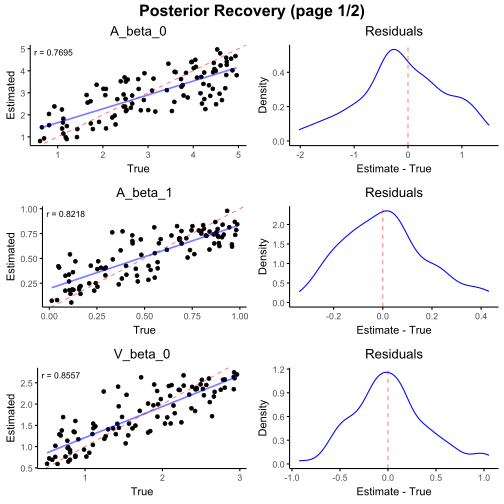
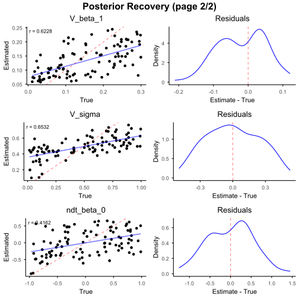
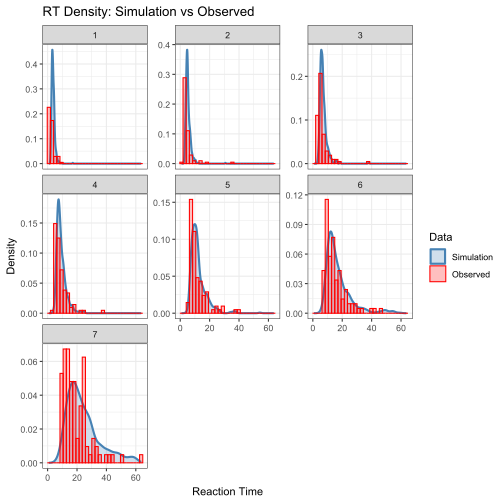

This section presents a real-world example illustrating how the proposed simulation-based inference workflow can be applied to empirical data.

Here, we used the free recall data from Penn Electrophysiology of Encoding and Retrieval Study (PEERS; Kahana et al., 2024). We model the recall process using a multi-response Racing Diffusion Model (RDM), focusing on RTs for first seven retrievaled items.

### Descriptions of the model

The details of this model are listed below:

**Priors on global parameters**

We specify weakly informative priors on the global parameters governing decision boundary, drift rate, non-decision time, and between-trial variability:

$$
  \begin{aligned}
  A_{\beta_0} &\sim \text{Uniform}(0.5, 5.0), \\
  A_{\beta_1} &\sim \text{Uniform}(0.01, 1.0), \\
  V_{\beta_0} &\sim \text{Uniform}(0.5, 3.0), \\
  V_{\beta_1} &\sim \text{Uniform}(0.01, 0.3), \\
  V_{\sigma} &\sim \text{Uniform}(0.01, 1.0), \\
  ndt_{\beta_0} &\sim \text{Uniform}(-1, 1).
  \end{aligned}
$$

**Between-trial variability**

To capture variabilities in recall trajectories and recall strategies across trials , we introduce a between-trial variability on the drift rate:

$$
  V_{\text{var}} \sim \mathcal{N}(0, V_{\sigma}).
$$

**Item-level parameterization**

At the item-level, different model parameters are linked to different structural aspects of the task. Specifically, the decision boundary is assumed to vary with the \emph{output position}, whereas the drift rate varies with the \emph{item index}.

Formally, we define
$$
  \begin{aligned}
  A &= A_{\beta_0} + \text{output position} \cdot A_{\beta_1}, \\
  V &= \max\!\left( V_{\beta_0} - \text{item index} \cdot V_{\beta_1} + V_{\text{var}}, \;
                    \theta \right)
  \end{aligned}
$$
where \( \theta > 0 \) is a small constant ensuring positivity of the drift rate.

**Evidence accumulation dynamics**

Within each trial, evidence evolves according to a Wiener diffusion process:

$$
  dX(t) = V_i \, dt + \sigma \, dW(t),
  \qquad
  dW(t) \sim \mathcal{N}(0, dt),
$$

A response is generated when one accumulator first reaches the decision boundary \( A_i \). The observed response time for item \( i \) is given by

$$
  RT_i = T_{\text{decision},i} + ndt_i .
$$

First, we load the required packages.


``` r
# Load necessary packages
library(eam)
library(dplyr)
library(tidyr)

# Set a random seed for reproducibility
set.seed(1)
```

Then, we specify the model configuration according to the setup described above.


``` r
#######################
# Model specification #
#######################
# Define the number of accumulators
n_items <- 7

# Specify the prior distributions for free parameters
prior_formulas <- list(
  n_items ~ 7,
  # parameters with distributions
  A_beta_0 ~ distributional::dist_uniform(0.50, 5.00),
  A_beta_1 ~ distributional::dist_uniform(0.01, 1.00),
  # V
  V_beta_0 ~ distributional::dist_uniform(0.5, 3.00),
  V_beta_1 ~ distributional::dist_uniform(0.01, 0.3),
  V_sigma ~ distributional::dist_uniform(0.01, 1.0),
  # ndt
  ndt_beta_0 ~ distributional::dist_uniform(-1, 1),
  # noise param
  noise_coef ~ 1
)

# Specify the between-trial components 
between_trial_formulas <- list(
  # random group binomial
  V_var ~ distributional::dist_normal(0, V_sigma)
)

# Specify the item-level parameters
item_formulas <- list(
  A ~ A_beta_0 + seq(1, n_items) * A_beta_1,
  V ~ pmax(V_beta_0 - seq(1, n_items) * V_beta_1 + V_var, 1e-5),
  ndt ~ ndt_beta_0
)

# Specify the diffusion noise
noise_factory <- function(context) {
  function(n, dt) {
    rnorm(n, mean = 0, sd = sqrt(dt))
  }
}
```

### Step two: Data simulation

We next generate simulated datasets from the specified model.

Depending on computational resources, this step may take approximately 30 minutes to 1 hour when parallelization is enabled.


``` r
####################
# Simulation setup #
####################
sim_config <- new_simulation_config(
  prior_formulas = prior_formulas,
  between_trial_formulas = between_trial_formulas,
  item_formulas = item_formulas,
  n_conditions_per_chunk = NULL, # automatic chunking
  n_conditions = 5000,
  n_trials_per_condition = 1000,
  n_items = n_items,
  max_reached = n_items,
  max_t = 60,
  dt = 0.001,
  noise_mechanism = "add",
  noise_factory = noise_factory,
  model = "ddm",
  parallel = TRUE,
  n_cores = NULL, # Will use default: detectCores() - 1
  rand_seed = NULL # Will use default random seed
)

##################
# Run simulation #
##################
sim_output <- run_simulation(
  config = sim_config
)
```

### Step three: Load observed data

For illustration purposes, we use data from one representative participant in the PEERS dataset as the observed data in this example.


``` r
#######################
# Load Observed data  #
#######################

observed_data <- read.csv("./30-empirical-example/example_data.csv")
observed_data$condition_idx <- 1
```

### Step four: Prepare inputs for inference

We construct the input for amortized Bayesian inference by specifying the model parameters to be estimated ($\theta$) and the observed variables ($Z$). The model is trained on simulated datasets and learns a mapping from data to parameters.

Here, we use reaction times (rt) as the input representation and split the simulated data into training and test sets.


``` r
#####################
# abi model prepare #
#####################

Z_observed <- observed_data %>%
  select(session_list, rank_idx, rt) %>%
  pivot_wider(
    names_from = session_list,
    values_from = rt
  ) %>%
  arrange(rank_idx)

Z_observed <- as.matrix(Z_observed[, -1])
rownames(Z_observed) <- paste0("rank_", observed_data$rank_idx %>% unique(), "_item_idx")

abi_input <- build_abi_input(
  sim_output,
  theta = c(
    "A_beta_0", "A_beta_1", "V_beta_0", "V_beta_1", "V_sigma", "ndt_beta_0"
  ),
  Z = c(
    "rt"
  ),
  train_ratio = 0.8,
  n_test = 100
)
```

### Step five: Fit the model

We perform amortized Bayesian inference to estimate the posterior distributions of model parameters.


``` r

#############################################
# Model validation and parameter estimation #
#############################################

posterior_estimator <- "
  d = 7    # dimension of each replicate
  w = 32   # number of neurons in each hidden layer

  # Layer to ensure valid estimates
  final_layer = Parallel(
      vcat,
      Dense(w, 1, softplus),
      Dense(w, 1, softplus),
      Dense(w, 1, softplus),
      Dense(w, 1, softplus),
      Dense(w, 1, softplus),
      Dense(w, 1, softplus)
    )

  psi = Chain(Dense(d, w, relu), Dense(w, w, relu), Dense(w, w, relu))
  phi = Chain(Dense(w, w, relu), Dense(w, w, relu), final_layer)
  deepset = DeepSet(psi, phi)
  w = 6
  q = NormalisingFlow(w, w)
  estimator = PosteriorEstimator(q, deepset)
"

trained_posterior_estimator <- abi_train(
  estimator = posterior_estimator,
  abi_input = abi_input,
  epochs = 200,
  stopping_epochs = 50,
  verbose = FALSE
)

# Sample from posterior distribution
posterior_samples <- abi_sample_posterior(
  trained_estimator = trained_posterior_estimator,
  Z = Z_observed,
  N = 1000
)

# Summarise posterior parameters for each dataset
posterior_summary <- summarise_posterior_parameters(posterior_samples)
print(posterior_summary)

# Cross-validation
posterior_samples <- abi_sample_posterior(
  trained_estimator = trained_posterior_estimator,
  N = 1000
)

plot_cv_recovery(
  posterior_samples,
  trained_estimator = trained_posterior_estimator
)
```



### Step six: Model evaluation

We assess model adequacy using posterior predictive checks by comparing reaction time distributions simulated from the fitted posterior with the observed data.


``` r
##############################
# Posterior predictive check #
##############################

abi_posterior_predictive_check(
  config = sim_config,
  trained_estimator = trained_posterior_estimator,
  estimator_type = "posterior",
  observed_df = observed_data,
  Z = Z_observed,
  posterior_dataset_id = 1,
  posterior_n_samples = 1000,
  rt_facet_x = c("rank_idx"),
  rt_facet_y = c(),
  accuracy_x = "rank_idx",
  accuracy_facet_x = c("ndt_beta_0"),
  accuracy_facet_y = c()
)
```



The results showed that, when fitted to the model, the estimated parameters accurately captured the shape of the observed reaction time distributions, thereby providing support for the validity of the model.

---
  
Reference:
  
Kahana, M. J., Lohnas, L. J., Healey, M. K., Aka, A., Broitman, A. W., Crutchley, P., Crutchley, E., Alm, K. H., Katerman, B. S., Miller, N. E., Kuhn, J. R., Li, Y., Long, N. M., Miller, J., Paron, M. D., Pazdera, J. K., Pedisich, I., Rudoler, J. H., & Weidemann, C. T. (2024). The Penn Electrophysiology of Encoding and Retrieval Study. Journal of Experimental Psychology: Learning, Memory, and Cognition, 50(9), 1421-1443. https://doi.org/10.1037/xlm0001319
